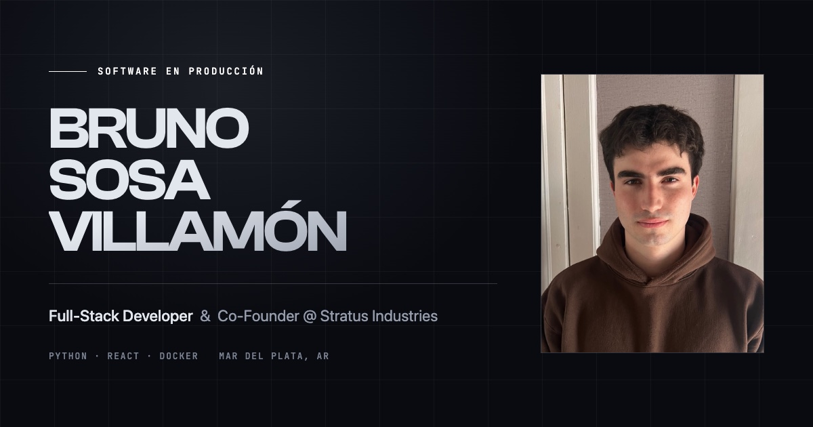

<h1 align="center">Bruno Sosa Villamón — Portfolio</h1>

<p align="center">
  Full-Stack Developer &amp; Co-Founder <a href="https://stratus-page.vercel.app/">@ Stratus Industries</a><br>
  <em>Construyo el software que sostiene negocios reales — de la primera línea de código al servidor en producción.</em>
</p>

<p align="center">
  <a href="#"><strong>Ver el sitio →</strong></a>
  ·
  <a href="https://www.linkedin.com/in/bruno-sosa-villam%C3%B3n-5a7308359/">LinkedIn</a>
  ·
  <a href="mailto:bsosavillamon@gmail.com">Email</a>
</p>

<p align="center">
  
</p>

<p align="center">
  
  
  
  
  
</p>

---

## Sobre el sitio

Portfolio personal de una sola página, escrito desde cero — sin plantilla, sin
librería de componentes y sin backend. Recorre quién soy, Stratus Industries y
tres sistemas que hoy están en producción con clientes reales usándolos todos
los días.

## Qué tiene

- **Bilingüe ES/EN** — todo el contenido está tipado y duplicado en los dos
  idiomas; si falta una traducción, el build falla. El idioma se elige solo
  según el navegador del visitante.
- **Tema claro y oscuro** — respeta `prefers-color-scheme` en la primera visita
  y recuerda la elección. Se aplica antes del primer pintado, sin parpadeo.
- **Contenido separado del código** — todo el texto vive en `src/content/`;
  actualizar el sitio no toca un solo componente.
- **Animaciones con Motion**, con `prefers-reduced-motion` respetado en todo el
  recorrido.
- **Listo para compartir** — etiquetas Open Graph y Twitter Card con imagen
  propia para la vista previa en LinkedIn, WhatsApp y Slack.
- Responsive, accesible por teclado y sin dependencias de runtime más allá de
  React y Motion.

## Proyectos que muestra

| Proyecto | Qué es | Stack |
| --- | --- | --- |
| **Stratus Cuts** | SaaS de gestión para barberías y peluquerías: turnos, caja, comisiones y recordatorios automáticos. En producción sobre VPS propio. | FastAPI · Python · MySQL · React · Docker |
| **Blue Moon** | Implementación del core de Stratus Cuts con frontend propio para un centro de estética. Validó el modelo multi-tenant. | React · Vite · FastAPI · Docker |
| **Telar Dankuk** | E-commerce a medida para un taller de tejido artesanal: catálogo por colecciones, carrito y canal mayorista. | React · JavaScript · CSS · MySQL |

## Stack del portfolio

**React 19** · **TypeScript** · **Vite 7** · **Tailwind CSS v4** · **Motion**

Sitio 100% estático: se compila a HTML, CSS y JS, sin servidor ni base de datos.
Tipografías: Clash Display, Switzer y JetBrains Mono.

## Correr en local

```bash
git clone https://github.com/bruno-sosav/Portafolio-Bruno.git
cd Portafolio-Bruno
npm install
npm run dev      # http://localhost:5173
```

| Comando | Qué hace |
| --- | --- |
| `npm run dev` | Servidor de desarrollo con hot reload |
| `npm run build` | Chequea tipos y compila a `dist/` |
| `npm run preview` | Sirve el build para revisarlo antes de publicar |

## Estructura

```
src/
├── components/   Secciones y piezas de UI (Hero, Projects, Stack, Contact…)
├── content/      Todo el texto del sitio, en español e inglés, tipado
├── hooks/        Tema, idioma, scroll y sección activa
├── i18n.tsx      Contexto de idioma
├── index.css     Tokens de color, tipografías y utilidades
└── App.tsx       Composición de la página
public/           Foto de perfil, capturas de proyectos e imagen Open Graph
```

## Documentación

El detalle de cómo editar contenido, agregar proyectos o idiomas, regenerar
capturas y desplegar está en **[`docs/MANTENIMIENTO.md`](docs/MANTENIMIENTO.md)**.

## Contacto

📧 **bsosavillamon@gmail.com** · 💼 [LinkedIn](https://www.linkedin.com/in/bruno-sosa-villam%C3%B3n-5a7308359/) · 🐙 [GitHub](https://github.com/bruno-sosav)

Disponible para trabajo remoto · Mar del Plata, Argentina

---

<p align="center"><sub>El código es de referencia. El contenido, las imágenes y la identidad visual son personales — por favor no los reutilices tal cual.</sub></p>
